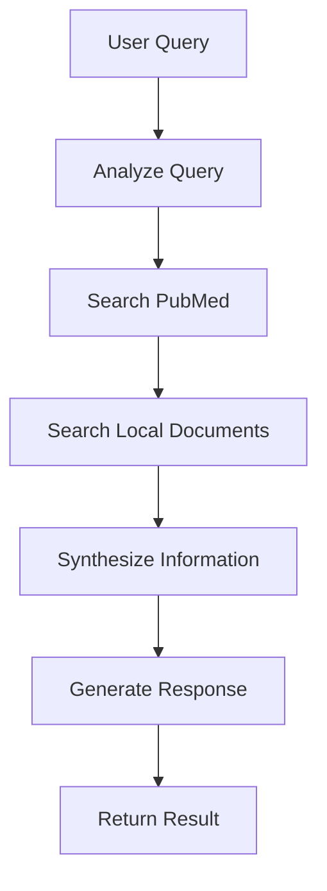

# PubMed CrossFit Agent

An intelligent agentic RAG (Retrieval-Augmented Generation) system that leverages PubMed scientific literature and local documents to provide evidence-based CrossFit coaching and education.

## Overview

The PubMed CrossFit Agent uses LangGraph and LangChain to create an intelligent workflow that:

1. **Searches PubMed** for relevant scientific articles about exercise, fitness, and CrossFit
2. **Queries local documents** stored in Qdrant vector database
3. **Synthesizes information** from multiple sources
4. **Provides personalized responses** for workout adaptations and educational content
5. **Maintains conversation memory** using LangGraph's state management

## Features

### 🔬 Scientific Research Integration
- Automatic PubMed searches with CrossFit/fitness context enhancement
- Retrieval of abstracts, authors, publication years, and PMIDs
- Intelligent query enhancement based on fitness topics

### 📚 Local Document RAG
- Integration with existing Qdrant vector store
- Semantic search across uploaded PDFs and documents
- Relevance scoring and source attribution

### 🏋️ Workout Adaptations
- Personalized workout modifications based on user profiles
- Safety-first approach with injury considerations
- Progressive overload and evidence-based recommendations

### 🎓 Educational Content
- Comprehensive explanations of exercise science concepts
- Accessible content for beginners and advanced athletes
- Practical applications and actionable takeaways

### 🧠 Intelligent Workflow
- Query intent analysis and routing
- Multi-source information synthesis
- Conversation memory and context preservation
- LangSmith integration for observability

## Installation

### Prerequisites

1. **Python 3.8+** with required dependencies:
```bash
pip install -r requirements.txt
```

2. **Environment Variables**:
```bash
# Required
OPENAI_API_KEY=your_openai_api_key

# Optional but recommended
langsmith_api_key=your_langsmith_api_key
QDRANT_URL=your_qdrant_cloud_url  # If using Qdrant Cloud
QDRANT_API_KEY=your_qdrant_api_key  # If using Qdrant Cloud
```

3. **PubMed Access**: No API key required, but provide a valid email for Entrez

## Usage

### Basic Usage

```python
from api.features.agents.pub_med_agent import create_pubmed_agent

# Create agent instance
agent = create_pubmed_agent()

# Query the agent
result = agent.query("What are the benefits of high-intensity interval training?")
print(result["response"])
```

### Async Usage

```python
import asyncio

async def main():
    agent = create_pubmed_agent()
    result = await agent.aquery("How should I modify squats for knee injury?")
    print(result["response"])

asyncio.run(main())
```

### FastAPI Endpoints

The agent is integrated into the main FastAPI application with the following endpoints:

#### General Query
```bash
POST /agents/query
```

**Request Body:**
```json
{
  "query": "What does research say about CrossFit and cardiovascular health?",
  "thread_id": "user_123",
  "user_profile": "Beginner, 6 months experience",
  "current_workout": "3 rounds: 10 burpees, 15 squats"
}
```

**Response:**
```json
{
  "response": "Research indicates that CrossFit training...",
  "pubmed_sources": [...],
  "local_sources": [...],
  "context_used": "...",
  "thread_id": "user_123"
}
```

#### Workout Adaptation
```bash
POST /agents/workout-adaptation
```

**Request Body:**
```json
{
  "user_profile": "Intermediate athlete with previous shoulder injury",
  "current_workout": "5x5 overhead press, 3 rounds of pull-ups",
  "query": "shoulder-safe modifications"
}
```

#### Educational Content
```bash
POST /agents/education
```

**Request Body:**
```json
{
  "topic": "proper deadlift technique",
  "query": "biomechanics and safety"
}
```

#### Health Check
```bash
GET /agents/health
```

## Configuration

The agent can be configured using environment variables or the `AgentConfig` class:

```python
from api.features.agents.config import AgentConfig

config = AgentConfig(
    model_name="gpt-4o-mini",
    temperature=0.1,
    pubmed_max_results=5,
    rag_k=5
)

agent = PubMedCrossFitAgent(
    openai_api_key="your_key",
    langsmith_api_key="your_langsmith_key"
)
```

### Configuration Options

| Parameter | Default | Description |
|-----------|---------|-------------|
| `model_name` | `gpt-4o-mini` | OpenAI model to use |
| `temperature` | `0.1` | LLM temperature for consistency |
| `pubmed_max_results` | `5` | Max PubMed articles per search |
| `rag_k` | `5` | Number of local documents to retrieve |
| `pubmed_email` | `crossfit.agent@example.com` | Email for PubMed Entrez |

## Architecture

### LangGraph Workflow



### Agent State

The agent maintains state throughout the workflow:

```python
class AgentState(TypedDict):
    messages: List[Message]           # Conversation history
    query: str                        # Current user query
    context: str                      # Synthesized information
    pubmed_results: List[Dict]        # PubMed search results
    local_rag_results: List[Dict]     # Local document results
    workout_plan: Optional[Dict]      # Generated workout plan
    educational_content: Optional[str] # Educational content
    next_action: str                  # Determined action type
```

### Tools

The agent includes four main tools:

1. **`search_pubmed`**: Searches PubMed for scientific articles
2. **`search_local_documents`**: Queries local Qdrant vector store
3. **`generate_workout_adaptation`**: Creates personalized workout modifications
4. **`provide_education`**: Generates educational content

## Testing

Run the comprehensive test suite:

```bash
cd api/features/agents
python test_agent.py
```

The test suite verifies:
- PubMed search functionality
- Local document retrieval
- Workout adaptation generation
- Educational content creation
- End-to-end query processing

## Examples

### Example 1: Research Query
```python
result = agent.query("What does research say about CrossFit and injury rates?")
# Returns: Evidence-based analysis with PubMed citations
```

### Example 2: Workout Modification
```python
result = agent.query(
    "I have a knee injury. How should I modify today's workout with box jumps?",
    user_profile="Intermediate, previous ACL surgery"
)
# Returns: Safe alternatives and modifications
```

### Example 3: Educational Content
```python
result = agent.query("Explain the biomechanics of the Olympic clean")
# Returns: Detailed educational content with scientific backing
```

## Troubleshooting

### Common Issues

1. **PubMed Search Fails**
   - Check internet connection
   - Verify email is set for Entrez
   - Try simpler search terms

2. **No Local Documents Found**
   - Ensure documents are uploaded and indexed
   - Check Qdrant connection
   - Verify collection name matches

3. **LangSmith Not Working**
   - Verify `langsmith_api_key` environment variable
   - Check project name configuration
   - Ensure LangSmith is enabled in config

4. **OpenAI API Errors**
   - Verify `OPENAI_API_KEY` is set correctly
   - Check API quota and billing
   - Try reducing context length

### Debug Mode

Enable debug logging:

```python
import logging
logging.basicConfig(level=logging.DEBUG)

agent = create_pubmed_agent()
```

## Contributing

When extending the agent:

1. **Add new tools** by decorating functions with `@tool`
2. **Modify the workflow** in `_build_graph()` method
3. **Update state** by modifying `AgentState` TypedDict
4. **Add tests** to `test_agent.py`
5. **Update documentation** in this README

## License

This project is part of the AI Certification Challenge and follows the project's licensing terms.
