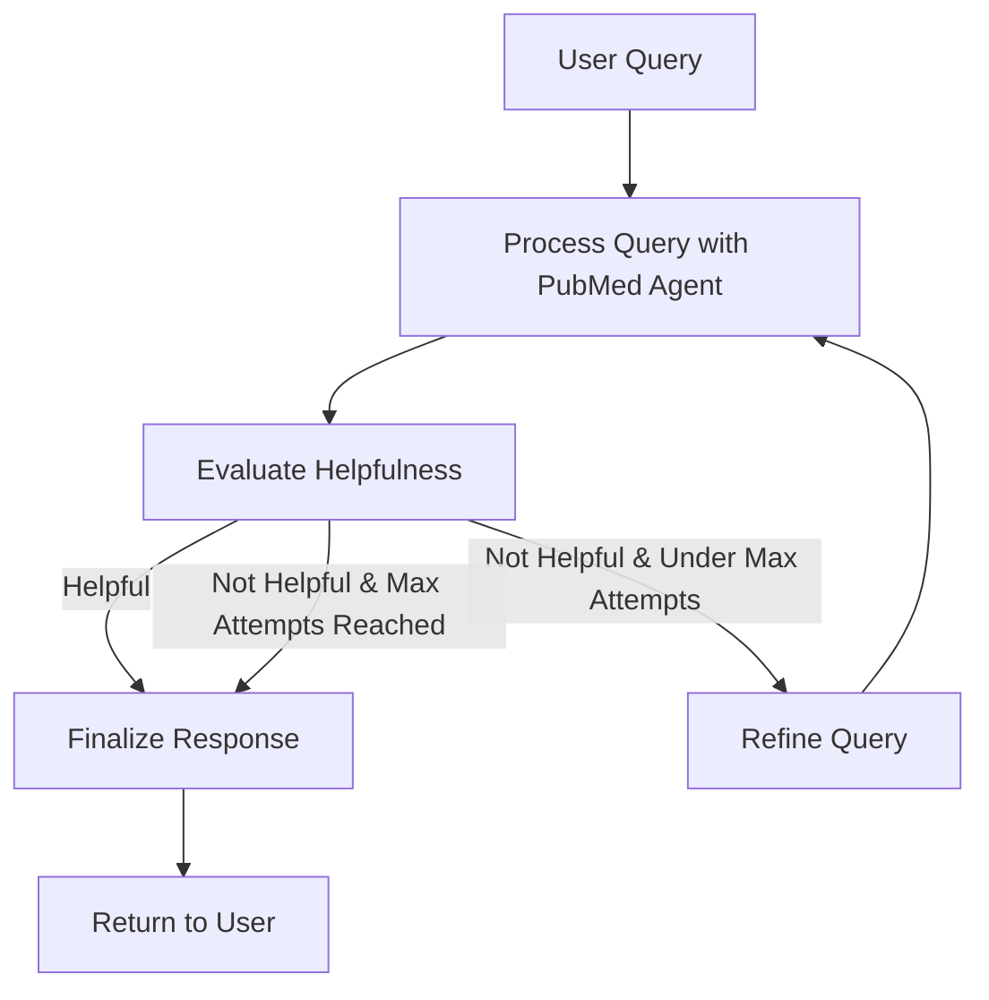

# Helpful Evaluator Agent

A LangGraph-based agent that evaluates responses from the PubMed CrossFit Agent for helpfulness and automatically refines them if needed.

## Overview

The Helpful Evaluator Agent creates a workflow that:

1. Takes a user query and processes it with the PubMed agent
2. Evaluates the response for helpfulness
3. If helpful, returns the response to the user
4. If not helpful, refines the query and tries again (up to a configurable number of attempts)
5. Returns the best response to the user

## Features

- **Automatic Response Evaluation**: Uses LLM to evaluate if responses are helpful
- **Query Refinement**: Automatically refines queries to get better responses
- **Configurable Retry Logic**: Set maximum number of refinement attempts
- **LangGraph Workflow**: Uses StateGraph for clear, maintainable agent logic
- **PubMed Integration**: Works with the existing PubMed CrossFit Agent
- **FastAPI Endpoints**: Ready-to-use API endpoints

## Installation

The agent is already integrated with the project. No additional installation is required beyond the project's existing dependencies.

## Usage

### Python API

```python
from api.features.agents.helpful_evaluator_agent import create_helpful_evaluator_agent

# Create agent instance
agent = create_helpful_evaluator_agent(max_attempts=3)

# Query the agent
result = agent.query("What are the benefits of CrossFit for cardiovascular health?")

# Access the response
print(result["response"])
print(f"Helpfulness score: {result['helpfulness_score']}")
print(f"Attempts made: {result['attempts']}")
```

### REST API

The agent exposes endpoints through FastAPI:

```bash
# Query the agent
curl -X POST "http://localhost:8000/agents/helpful/query" \
  -H "Content-Type: application/json" \
  -d '{"query": "What are the benefits of CrossFit for cardiovascular health?", "max_attempts": 3}'

# Health check
curl "http://localhost:8000/agents/helpful/health"
```

## Integration with FastAPI App

To integrate the helpful agent endpoints with your main FastAPI application:

1. Add the router to your main app:

```python
from api.features.agents.helpful_agent_endpoints import router as helpful_agent_router

app = FastAPI()
app.include_router(helpful_agent_router)
```

## Example Script

An example script is provided to demonstrate the agent's capabilities:

```bash
# Run the example script
python -m api.features.agents.example_helpful_agent
```

## How It Works

### LangGraph Workflow



### Agent State

The agent maintains state throughout the workflow:

```python
class EvaluatorAgentState(TypedDict):
    messages: List[Message]           # Conversation history
    query: str                        # Current user query
    pubmed_response: str              # Response from PubMed agent
    helpfulness_score: str            # Y if helpful, N if not
    attempt_count: int                # Number of attempts made
    max_attempts: int                 # Maximum number of attempts
    final_response: str               # Final response to return
```

## Configuration Options

| Parameter | Default | Description |
|-----------|---------|-------------|
| `model_name` | `gpt-4o-mini` | OpenAI model to use |
| `temperature` | `0.1` | LLM temperature for consistency |
| `max_attempts` | `3` | Maximum number of refinement attempts |

## Troubleshooting

### Common Issues

1. **PubMed Agent Not Responding**
   - Check that the PubMed agent is properly initialized
   - Verify that the data path is correct
   - Check for any errors in the PubMed agent logs

2. **Endless Refinement Loop**
   - This shouldn't happen due to the max_attempts limit
   - If you see unusual behavior, check the helpfulness evaluation logic

3. **API Errors**
   - Verify that FastAPI is running correctly
   - Check that the router is properly included in the main app

## Contributing

When extending the agent:

1. **Add new evaluation criteria** in the `_evaluate_helpfulness` method
2. **Modify the workflow** in `_build_graph()` method
3. **Update state** by modifying `EvaluatorAgentState` TypedDict
4. **Add tests** to verify functionality
