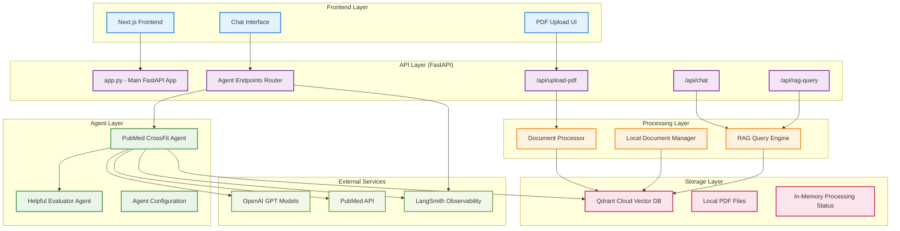

# Component Architecture Diagram

```mermaid
graph TB
    subgraph "Frontend Layer"
        UI[Next.js Frontend]
        Chat[Chat Interface]
        Upload[PDF Upload UI]
    end
    
    subgraph "API Layer (FastAPI)"
        App[app.py - Main FastAPI App]
        AgentRouter[Agent Endpoints Router]
        ChatEndpoint["/api/chat"]
        RAGEndpoint["/api/rag-query"]
        UploadEndpoint["/api/upload-pdf"]
    end
    
    subgraph "Agent Layer"
        PubMedAgent[PubMed CrossFit Agent]
        HelpfulEvaluator[Helpful Evaluator Agent]
        AgentConfig[Agent Configuration]
    end
    
    subgraph "Processing Layer"
        DocProcessor[Document Processor]
        LocalDocManager[Local Document Manager]
        RAGEngine[RAG Query Engine]
    end
    
    subgraph "Storage Layer"
        QdrantCloud[Qdrant Cloud Vector DB]
        LocalPDFs[Local PDF Files]
        ProcessingStatus[In-Memory Processing Status]
    end
    
    subgraph "External Services"
        OpenAI[OpenAI GPT Models]
        PubMedAPI[PubMed API]
        LangSmith[LangSmith Observability]
    end
    
    %% Connections
    UI --> App
    Chat --> AgentRouter
    Upload --> UploadEndpoint
    
    AgentRouter --> PubMedAgent
    ChatEndpoint --> RAGEngine
    RAGEndpoint --> RAGEngine
    UploadEndpoint --> DocProcessor
    
    PubMedAgent --> HelpfulEvaluator
    PubMedAgent --> PubMedAPI
    PubMedAgent --> OpenAI
    PubMedAgent --> QdrantCloud
    
    DocProcessor --> QdrantCloud
    LocalDocManager --> QdrantCloud
    RAGEngine --> QdrantCloud
    
    PubMedAgent --> LangSmith
    AgentRouter --> LangSmith
    
    %% Styling
    classDef frontend fill:#e3f2fd,stroke:#1976d2,stroke-width:2px
    classDef api fill:#f3e5f5,stroke:#7b1fa2,stroke-width:2px
    classDef agent fill:#e8f5e8,stroke:#388e3c,stroke-width:2px
    classDef processing fill:#fff3e0,stroke:#f57c00,stroke-width:2px
    classDef storage fill:#fce4ec,stroke:#c2185b,stroke-width:2px
    classDef external fill:#f1f8e9,stroke:#689f38,stroke-width:2px
    
    class UI,Chat,Upload frontend
    class App,AgentRouter,ChatEndpoint,RAGEndpoint,UploadEndpoint api
    class PubMedAgent,HelpfulEvaluator,AgentConfig agent
    class DocProcessor,LocalDocManager,RAGEngine processing
    class QdrantCloud,LocalPDFs,ProcessingStatus storage
    class OpenAI,PubMedAPI,LangSmith external
```
