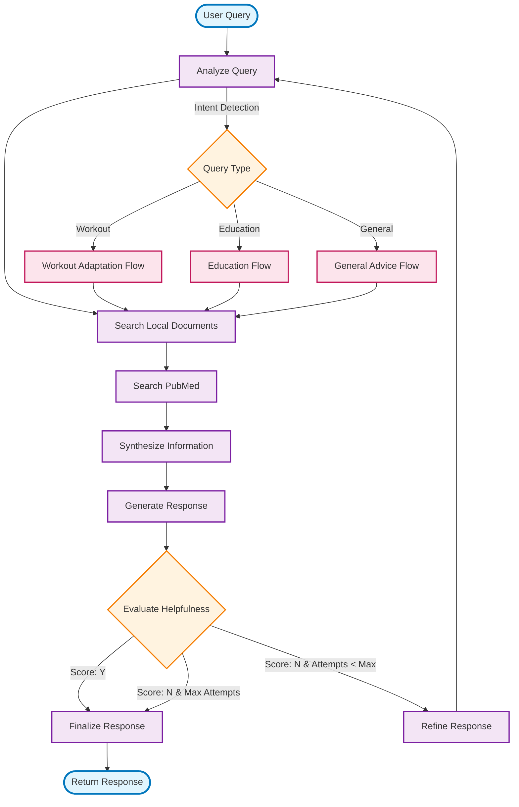

# LangGraph Workflow Diagram

## Workflow Details

### Node Functions:

1. **Analyze Query**: Determines query intent and type
2. **Search Local**: Retrieves relevant local document chunks
3. **Search PubMed**: Fetches scientific articles from PubMed API
4. **Synthesize Information**: Combines all sources into context
5. **Generate Response**: Creates initial response using LLM
6. **Evaluate Helpfulness**: Scores response quality (Y/N)
7. **Refine Response**: Improves query and regenerates if needed
8. **Finalize Response**: Prepares final output for user

### Key Features:

- **Helpfulness Loop**: Automatic quality control with up to 3 attempts
- **Multi-source RAG**: Combines local docs + PubMed research
- **Intent-based Routing**: Different flows for workout, education, general queries
- **Memory Management**: LangGraph MemorySaver for conversation state
- **Observability**: LangSmith tracing throughout workflow
