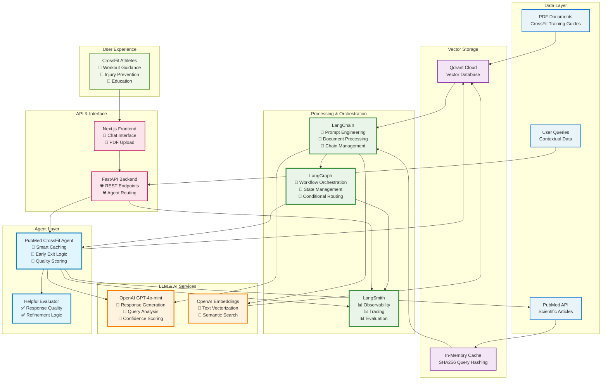

# CrossFit LLM App Stack

## CrossFit LLM Application Stack

### **🏗️ Architecture Overview**

This diagram shows how our CrossFit application leverages the modern LLM app stack for intelligent fitness guidance.

### **📊 Stack Components**

#### **Data Layer**

- **PDF Documents**: CrossFit training guides, injury prevention materials
- **PubMed API**: Scientific research articles for evidence-based responses
- **User Queries**: Contextual workout and health questions

#### **Vector Storage**

- **Qdrant Cloud**: Scalable vector database for semantic search
- **In-Memory Cache**: SHA256-based query deduplication for performance

#### **Processing & Orchestration**

- **LangChain**: Prompt engineering, document processing, chain management
- **LangGraph**: Advanced workflow orchestration with conditional routing
- **LangSmith**: Full observability, tracing, and evaluation

#### **LLM & AI Services**

- **OpenAI GPT-4o-mini**: Response generation, analysis, confidence scoring
- **OpenAI Embeddings**: Text vectorization for semantic search

#### **Agent Layer** 🚀

- **PubMed CrossFit Agent**: Optimized with caching, early exit, quality scoring
- **Helpful Evaluator**: Response quality assessment and refinement

#### **API & Interface**

- **FastAPI**: High-performance backend with REST endpoints
- **Next.js**: Modern frontend with chat interface and PDF upload

### **🔄 Data Flow**

1. **Data Ingestion**: PDFs → Vector Storage, PubMed → Cache
2. **Query Processing**: User → Frontend → API → Agent
3. **Intelligent Routing**: Cache Check → Local Search → Confidence Eval → Conditional PubMed
4. **Response Generation**: Context Synthesis → Quality Scoring → LLM → Response
5. **Quality Control**: Helpfulness Evaluation → Refinement → Cache Storage

### **⚡ Performance Optimizations**

- **Smart Caching**: Eliminates redundant API calls
- **Early Exit Logic**: Skips unnecessary external searches
- **Quality-Aware Generation**: Adaptive response strategies
- **Observability**: Full workflow tracing and monitoring

### **🎯 Use Cases**

- **Workout Adaptation**: Personalized exercise modifications
- **Injury Prevention**: Evidence-based safety guidance
- **Education**: Scientific explanations of CrossFit principles
- **Performance Optimization**: Data-driven training advice
