# CrossFit AI System - Package Diagram

```mermaid
graph TB
    subgraph "Frontend Package"
        FE[Next.js Frontend<br/>📱 User Interface<br/>💬 Chat Components<br/>📄 File Upload]
    end

    subgraph "API Package"
        API[FastAPI Backend<br/>🌐 REST Endpoints<br/>🔌 Agent Integration<br/>📊 Request Handling]
    end

    subgraph "Agent Package"
        AGENT[PubMed CrossFit Agent<br/>🤖 Intelligent Query Processing<br/>🚀 Performance Optimized<br/>📈 Quality Evaluation]
    end

    subgraph "RAG Package"
        RAG[Enhanced RAG System<br/>🔍 Document Retrieval<br/>📚 Context Synthesis<br/>🎯 Semantic Search]
    end

    subgraph "Evaluation Package"
        EVAL[Helpfulness Evaluator<br/>✅ Response Quality<br/>🔄 Refinement Logic<br/>📊 Performance Metrics]
    end

    subgraph "Observability Package"
        OBS[LangSmith Integration<br/>📈 Workflow Tracing<br/>🔍 Performance Monitoring<br/>📊 Analytics Dashboard]
    end

    subgraph "External Services"
        EXT[Third-party APIs<br/>🧠 OpenAI Models<br/>📚 PubMed Research<br/>🗄️ Qdrant Vector DB]
    end

    %% Package Dependencies
    FE --> API
    API --> AGENT
    AGENT --> RAG
    AGENT --> EVAL
    AGENT --> OBS
    RAG --> EXT
    AGENT --> EXT
    OBS --> EXT

    %% Styling
    classDef frontend fill:#e3f2fd,stroke:#1976d2,stroke-width:3px
    classDef api fill:#f3e5f5,stroke:#7b1fa2,stroke-width:3px
    classDef agent fill:#e8f5e8,stroke:#388e3c,stroke-width:3px
    classDef rag fill:#fff3e0,stroke:#f57c00,stroke-width:3px
    classDef eval fill:#e1f5fe,stroke:#0277bd,stroke-width:3px
    classDef obs fill:#fce4ec,stroke:#c2185b,stroke-width:3px
    classDef external fill:#f1f8e9,stroke:#689f38,stroke-width:3px

    class FE frontend
    class API api
    class AGENT agent
    class RAG rag
    class EVAL eval
    class OBS obs
    class EXT external
```

## Package Overview

### **📦 Core Packages**

#### **Frontend Package**

- **Purpose**: User interface and interaction layer
- **Technologies**: Next.js, React, TypeScript
- **Responsibilities**: Chat interface, PDF upload, user experience

#### **API Package**

- **Purpose**: Backend service layer and request routing
- **Technologies**: FastAPI, Python
- **Responsibilities**: REST endpoints, authentication, request handling

#### **Agent Package**

- **Purpose**: Intelligent query processing and workflow orchestration
- **Technologies**: LangGraph, LangChain
- **Responsibilities**: Query analysis, caching, early exit logic, response generation

#### **RAG Package**

- **Purpose**: Document retrieval and context synthesis
- **Technologies**: Enhanced RAG, vector embeddings
- **Responsibilities**: Semantic search, document processing, context quality scoring

#### **Evaluation Package**

- **Purpose**: Response quality assessment and improvement
- **Technologies**: Custom evaluation agents
- **Responsibilities**: Helpfulness scoring, query refinement, performance metrics

#### **Observability Package**

- **Purpose**: System monitoring and analytics
- **Technologies**: LangSmith, custom logging
- **Responsibilities**: Workflow tracing, performance monitoring, debugging

### **🔗 Package Dependencies**

- **Frontend** → **API**: HTTP requests for all user interactions
- **API** → **Agent**: Route queries to intelligent processing system
- **Agent** → **RAG**: Retrieve and synthesize relevant context
- **Agent** → **Evaluation**: Assess and improve response quality
- **Agent** → **Observability**: Track workflow execution and performance
- **All Core Packages** → **External Services**: Leverage third-party APIs and services

### **🎯 Design Principles**

- **Separation of Concerns**: Each package has a single, well-defined responsibility
- **Loose Coupling**: Packages communicate through well-defined interfaces
- **High Cohesion**: Related functionality is grouped within packages
- **Scalability**: Packages can be independently scaled and deployed
- **Maintainability**: Clear boundaries enable easier testing and updates
